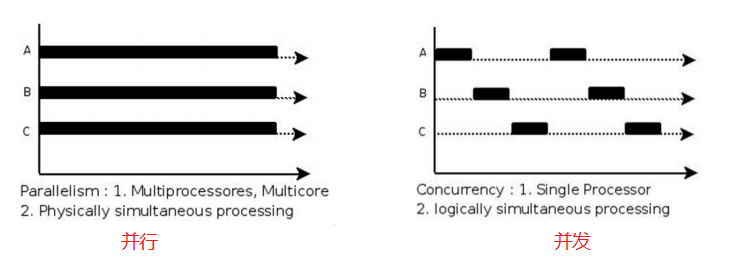
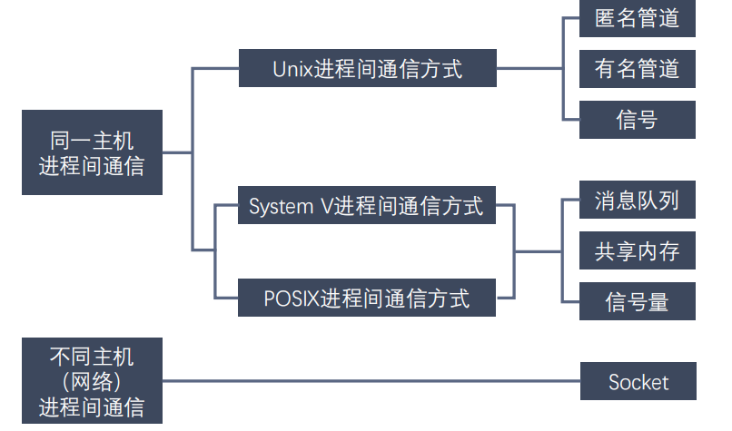
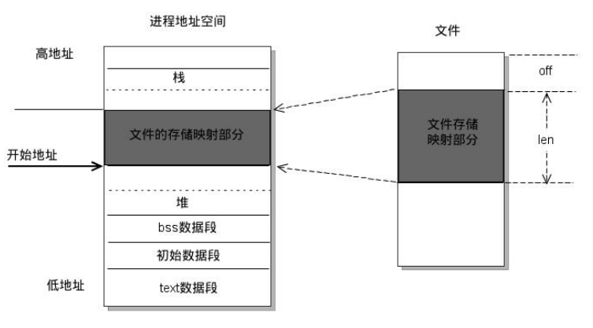

# 进程概述

- 程序：包含一系列信息的文件，这些信息描述了如何在运行时创建一个`进程`

- 进程是**正在运行的程序的实例**。是一个具有一定独立功能的程序关于某个数据集合的一次运行活动。是操作系统动态执行的**基本单元**，是基本的分配单元

- 从内核角度看，进程由用户内存空间和一系列内核数据结构组成

## 单道、多道程序设计

对于一个单 CPU 系统来说，在任意时刻，CPU 上运行的程序只有一个

## 时间片

时间片由操作系统内核的调度程序分配给每个进程

## 并行和并发

- 并行parallel：同一时刻，多条指令在多个处理器同时执行
- 并发concurrency：同一时刻，只能有一条指令在执行，但多个进程指令快速轮换执行，使得宏观上具有多个进程同时执行的效果



## 进程控制块Process Control Block

- 操作系统内核为每一个进程分配PCB，维护进程信息，Linux内核的进程控制块是`task_struct`结构体
- PCB 包括：
  - 进程ID 
  - 进程状态（就绪、运行、挂起、停止）
  - 描述虚拟地址空间的信息
  - 描述控制终端的信息
  - 会话Session和进程组process group
  - 进程资源上限

> Linux中可以使用`ulimit -a`查看资源上限

# 进程状态

## 三态模型

- 运行
- 就绪：进程具备运行条件，等待系统分配处理器便可以立即执行
- 阻塞：不具备运行条件，等待某个事件的完成

## 五态模型

比三态模型多了新建态和终止态

## 进程相关命令

```shell
man ps	# 查看 ps 的使用说明

ps aux	# 查看进程（静态）

top		# 查看进程（动态）

kill -l	# 列出所有信号

kill -<signal nunber> <pid>	# 杀死进程
```

## 进程号

任何进程（除了 init 进程）都是由另一个进程创建


# 进程创建：fork()

```c
// 创建进程

#include <sys/types.h>
#include <unistd.h>
#include <stdio.h>

int main(int argc, char **argv)
{
    // fork之后的所有代码父子进程都有
    pid_t pid = fork();
	
    // 父进程返回子进程ID，子进程返回0
    printf("pid : %d\n", pid);

    if (pid > 0)
    {
   		printf("I am parent process, pid : %d, ppid : %d\n", getpid(), getppid());
    }
    else if (pid == 0)
    {
        printf("I am child process, pid : %d, ppid : %d\n", getpid(), getppid());
    }

    return 0;
}
```

## fork原理

- 一句话：读时共享，写时拷贝

- Linux 的 `fork()` 使用是通过**写时拷贝 (copy- on-write) 实现**。写时拷贝是一种可以推迟甚至避免拷贝数据的技术

- 内核此时并不复制整个进程的地址空间，而是让**父子进程共享同一个地址空间**，只有在**需要写入的时候**才会复制地址空间，从而使各个进程拥有各自的地址空间。即**资源的复制是在需要写入的时候才会进行，在此之前，只有以只读方式共享**（示例程序中`num`的作用）

- **fork之后父子进程共享文件**。fork产生的子进程与父进程**有相同的文件描述符，指向相同的文件表**，引用计数增加，共享文件偏移指针

# 进程控制

## 进程退出

```c
// 进程退出的方式

exit();		// 标准c库

_exit();	// Linux系统
```

## 孤儿进程Orphan Process

概念：

父进程运行结束，子进程还在运行，这样的子进程称为**孤儿进程**

- 孤儿进程没有危害
- 内核将孤儿进程的父进程设置为`init`，而该进程会循环`wait()`回收子进程资源

```c
// 模拟产生孤儿进程

#include <sys/types.h>
#include <unistd.h>
#include <stdio.h>

int main(int argc, char **argv)
{
    printf("Begin\n");

    // 如果成功创建子进程，在父进程中返回子进程的ID，在子进程中返回0；
    // 如果失败，在父进程中返回-1，在子进程中返回errno;
    pid_t pid = fork();

    printf("pid : %d\n", pid);

    if (pid > 0)
    {
        printf("I am parent process, pid : %d, ppid : %d\n", getpid(), getppid());
    }
    else if (pid == 0)
    {
        // 子进程称为孤儿进程
        sleep(1);   // 控制父进程结束而子进程未结束
        printf("I am child process, pid : %d, ppid : %d\n", getpid(), getppid());
    }

    return 0;
}
```

## 僵尸进程

前情提要：

每个进程结束之后，都会释放自己地址空间中的用户区数据，内核区的 PCB 没有办法自己释放掉，需要父进程去释放


产生原因：
当一个子进程终止时，**内核不会立刻销毁其所有资源**，而是保留该进程的退出状态，直到父进程通过`wait()`或`waitpid()`系统调用读取这些信息。而处于中间的过程的子进程就是僵尸进程。


本质：
子进程终止后，父进程未回收其退出状态信息的中间状态


危害：
每个僵尸进程会占用一个进程号，如果大量僵尸进程产生，可能导致系统无法创建新进程


如果父进程不通过`wait()`回收子进程PCB信息：

直到父进程终止，僵尸进程会被`init`进程接管并回收


```c
// 模拟产生僵尸进程

#include <sys/types.h>
#include <unistd.h>
#include <stdio.h>

int main(int argc, char **argv)
{
    // 如果成功创建子进程，在父进程中返回子进程的ID，在子进程中返回0；
    // 如果失败，在父进程中返回-1，没有子进程被创建;
    pid_t pid = fork();

    if (pid > 0)
    {
        // 模拟父进程长时间运行
        while(1)
        {
            printf("I am parent process, pid : %d, ppid : %d\n", getpid(), getppid());
            sleep(2);
        }
    }
    else if (pid == 0)
    {
        // 子进程终止时父进程尚未回收子进程资源
        printf("I am child process, pid : %d, ppid : %d\n", getpid(), getppid());
    }

    return 0;
}
```

## 进程回收

- 使用`wait()`或`waitpid()`回收进程资源
- 区别：
  - `wait()`函数阻塞
  - `waitpid()`函数可以设置是否阻塞，以及指定等待哪个子进程结束
- 注意：**一次`wait`只能回收一个子进程，所以要循环调用**

```c
// 使用wait()回收进程，当使用kill命令手动杀死子进程时，父进程wait函数回收资源，并打印退出的子进程的ID

/*
进程回收：wait();

等待任意一个子进程结束，如果任意一个子进程结束了，该函数会回收子进程的资源；

调用wait函数的进程会被挂起（阻塞），直到它的一个子进程退出或收到一个不可被忽略的信号时才被唤醒(继续执行);

返回值：
    On success, return the process ID of the terminated child, on error, return -1;
*/

// wait()
#include <sys/types.h>
#include <sys/wait.h>
#include <stdio.h>
#include <sys/types.h>
#include <unistd.h>

int main(int argc, char **argv)
{

    pid_t pid;

    // 产生5个子进程
    for (int i = 0; i < 5; ++i)
    {
        /*
        On success, the PID of the child process is returned in the parent,
        and 0 is returned in the child; on failure, -1 is returned in the parent, no child 
        process is created;
        */ 
        pid = fork();
        if (pid == 0)
            break; // 如果是子进程，则不继续产生新的进程
    }

    if (pid > 0)
    {
        // 父进程
        while (1)
        {
            printf("Parent Process, pid = %d\n", getpid());

            int ret = wait(NULL);   // 阻塞直到子进程退出才继续往下执行
            if (ret == -1) break;
            printf("Child died, pid = %d\n", ret);

            sleep(2);
        }
    }
    else if (pid == 0)
    {
        // 子进程
        while (1)
        {
            printf("Child Process, pid = %d, ppid = %d\n", getpid(), getppid());

            sleep(2);
        }
    }

    return 0;
}
```

```c
// 使用waitpid回收进程资源

/*
进程回收：waitpid();

功能：回收指定ID的进程，可以设置非阻塞；

调用：pid_t waitpid(pid_t pid, int *wstatus, int options);

参数：
    pid:
        == -1, 回收所有的子进程，相当于wait();最常用的；
        == 0;  回收当前进程组的子进程；
        > 0;   回收某个子进程的pid；
        < -1;  回收进程组ID为pid绝对值的进程组的子进程；

    options:
        0: 阻塞
        WNOHANG: 非阻塞

    返回值：
        > 0;  返回回收的某个子进程的ID；
        == 0; (非阻塞状态)表示由pid指定的子进程仍然存在；
        == -1; 错误或没有待回收的子进程；

*/
#include <stdio.h>
#include <sys/types.h>
#include <unistd.h>
#include <wait.h>
#include <stdlib.h>

int main()
{
    pid_t pid;

    // 创建3个子进程
    for (int i = 0; i < 3; ++i)
    {
        pid = fork();
        if (pid == 0)
        {
            break;
        }
    }

    if (pid > 0)
    {
        // parent process
        while (1)
        {
            printf("Parent Process ID: %d\n", getpid());
            int ret = waitpid(-1, NULL, WNOHANG); // don't block waiting 不阻塞
            if (ret == -1)
            {
                perror("waitpid");
                exit(0);
            }
            else if (ret == 0)
            {
                printf("Child Process is still running\n");
            }
            else
            {
                printf("Child Process %d was terminated\n", ret);
            }
            sleep(3);
        }
    }
    else if (pid == 0)
    {
        // child process
        while (1)
        {
            printf("Child Process ID: %d, Parent Process ID: %d\n", getpid(), getppid());
            sleep(3);
        }
    }

    return 0;
}
```


# exec函数族

作用：

在调用进程的内部执行一个可执行文件；调用失败时，返回-1；

- `int execl(const char *path, const char *arg, .../* (char *) NULL */);`
  - path`：需要指定的执行的文件的路径或者名称`
  - `arg`：是执行可执行文件所需要的参数列表。第一个参数一般没有什么作用，为了方便，一般写的是执行的程序的名称，从第二个参数开始往后，就是程序执行所需要的的参数列表，参数最后需要以NULL结束（哨兵）

```c
// 通过execl函数替换子进程

#include <stdio.h>
#include <unistd.h>

int main(int argc, char **argv)
{
    __pid_t pid = fork();   // 创建子进程

    if (pid > 0)
    {
        printf("I am parent Process, pid = %d\n", getpid());
        sleep(1);   // 防止父进程结束过快出现孤儿进程
    }
    else if (pid == 0)
    {
        // 子进程会被替换为a.out
        execl("a.out", "a.out", NULL);
        // 调用系统进程
        // execl("/bin/ps", "ps", "aux", NULL);

        printf("I am child Process, pid = %d\n", getpid());
    }

    // 检验子进程是否被替换，子进程被替换，则只有父进程输出下列内容
    for (int i = 0; i < 3; ++i)
    {
        printf("i = %d, pid = %d\n", i, getpid());
    }

    return 0;
}
```


# 进程间通信 IPC

## 概念

- why: 进程是一个独立的资源分配单元，不同用户进程之间的资源相互独立，不能在一个进程中直接访问另一个进程的资源
- how: （进程间通信方式）
  - 管道
  - 内存映射
  - 信号
  - 共享内存

## Linux 进程间通信方式



## 管道

是什么：
管道是一个在内核内存中维护的**缓冲器**，存储能力有限，不同操作系统中大小可能不同


管道的特点：

- 管道拥有文件的特质：读操作、写操作
- 一个管道是一个字节流，使用管道不存在消息或者消息边界的概念，从管道读取数据的进程可以读取任意大小的数据块，而不管写入管道的数据块的大小是多少
- 通过管道传递的数据是顺序的
- 管道是**半双工**的：数据的传递方向是单向的，一端用于写入，一端用于读取
- 管道读取数据是一次性操作，一旦数据被读取，就会释放空间以便写更多的数据，**在管道中无法使用`lseek()`来随机的访问数据


> 数据的三种传输模式：
>
> - 单工：只支持信号在一个方向上传输（正向或反向），任何时候不能改变信号的传输方向
> - 半双工：允许信号在两个方向上传输，但某一时刻只允许信号在一个信道上单向传输，实际上是一种**可切换方向的单工通信**
> - 双工：允许信号同时在两个方向上传输


管道的分类：匿名管道、有名管道

- **匿名管道**没有文件实体，只能在**具有公共祖先的进程（父子，兄弟）之间使用**
- **有名管道**有文件实体，但是不存储数据，可以**按照操作文件的方式**对管道进行操作


管道的数据结构：
环形队列


### 匿名管道

- 管道又叫做匿名管道，是UNIX系统进程间通信最古老的方式，所有的UNIX系统都支持这种通信机制

- 管道默认阻塞：如果管道中没有数据，则 read 阻塞；如果管道中数据满了，则 write 阻塞；
- 匿名管道应该在子进程创建前生成，否则父子进程不一定对应同一个管道！
- 创建管道时，`int pipefd[2]`是传出参数，描述管道的读端写端

#### 创建管道

```c
/*
匿名管道的创建，子进程写数据，父进程读数据
*/
/*
pipe: 创建匿名管道

#include <unistd.h>

int pipe(int pipefd[2]);
int pipe2(int pipefd[2], int flags);

功能：
    创建匿名管道；

参数：int pipefd[2] 是传出参数
    pipefd[0]：读端
    pipefd[1]：写端

返回值：
    成功：返回0
    失败：返回-1，errno设置为相应的错误码
    失败的原因：
        1. 参数错误：pipefd为NULL，或者pipefd[0]和pipefd[1]指向同一内存
        2. 系统资源不足：内核无法分配足够的资源来创建管道
        3. 超出系统限制：系统限制了管道的数量或大小
        4. 权限问题：当前进程没有足够的权限来创建管道
        5. 内存不足：系统内存不足，无法创建管道
        6. 文件描述符限制：当前进程打开的文件描述符数量超过了系统限制
        7. 其他错误：其他系统错误，例如内核错误等

注意：
    匿名管道只能用于具有公共祖先的进程之间的通信；
    管道默认是阻塞的：如果管道没有数据，read阻塞；如果管道满了，write阻塞；
*/

#include <stdio.h>
#include <unistd.h>
#include <sys/types.h>
#include <stdlib.h>
#include <string.h>

int main()
{
    // 1.create pipe before fork
    int pipefd[2];	// 管道的文件描述符，传出参数
    int ret = pipe(pipefd);
    if (ret == -1)
    {
        perror("pipe");
        exit(0);
    }

    // 2.create child process
    pid_t pid = fork();

    if (pid > 0)
    {
        // parent process, read data
        close(pipefd[1]); // close write end

        char buff[1024] = {0};

        // 设置管道非阻塞(optional)...
        
        while (1)
        {
            read(pipefd[0], buff, sizeof(buff));
            printf("Parent Process received: %s\n", buff);
        }
    }
    else if (pid == 0)
    {
        // child process, write data
        close(pipefd[0]); // close read end

        char *str = "Hello World, I am Child Process - ";
        int count = 0;

        while (1)
        {
            count++;
            char msg[256];
            // 格式化消息
            int len = snprintf(msg, sizeof(msg), "%s%d\n", str, count);
            // 写入管道
            write(pipefd[1], msg, len);
            sleep(1); // avoid write too fast
        }
    }
    return 0;
}
```

#### 设置管道非阻塞

```c
// 设置管道读端非阻塞
int flags = fcntl(pipefd[0], F_GETFL); // 获取原来的flag
flags |= O_NONBLOCK;                   // 修改flag的值
fcntl(pipefd[0], F_SETFL, flags);      // 设置新的flag
```

#### 匿名管道读写总结

- 读管道 read
  - 有数据，返回读到的字节数
  - 无数据
    - 写端全部关闭，返回0
    - 写端未全部关闭，阻塞等待
- 写管道 write
  - 管道读端全部关闭，进程异常终止（收到`SIGPIPE`信号）
  - 管道读端未全部关闭
    - 管道已满，阻塞等待
    - 管道未满，返回实际写入的字节数

### 有名管道

- 匿名管道只能用于有亲缘关系间进程的通信，为了克服缺点，提出了**有名管道**，也叫**命名管道、FIFO**
- FIFO以文件形式存在于文件系统中，其操作与普通文件一致
- FIFO, first in first out, 数据先入先出

#### 有名管道和匿名管道的区别

- FIFO 以文件形式存在于文件系统中，但不存储数据，其内容存放在**内存中**
- 使用 FIFO 的进程退出后，FIFO 将继续保存在文件系统中一边后续使用
- 不相关的进程也可以通过 FIFO 进行通信

#### 创建有名管道 FIFO

- shell 命令创建：

```shell
mkfifo <filename>
```

- 函数创建：

```c
/*
创建FIFO

1.通过命令mkfifo;
2.通过函数；
        #include <sys/types.h>
        #include <sys/stat.h>

        int mkfifo(const char *pathname, mode_t mode);

        参数：
            pathname: 文件路径
            mode: 文件权限，八进制数
*/

#include <stdio.h>
#include <sys/types.h>
#include <sys/stat.h>
#include <stdlib.h> // exit()
#include <unistd.h> // access()

int main()
{
    // 判断FIFO是否存在
    int ret = access("fifo1", F_OK);
    if (ret == -1)
    {
        // 不存在
        printf("创建管道\n");
        
        // 通过函数创建FIFO
        int ret = mkfifo("fifo1", 0664); // 0664是管道文件的文件权限

        if (ret == -1)
        {
            perror("mkfifo");
            exit(0);
        }
    }

    return 0;
}
```

> # 文件权限详解
>
> Unix 文件权限由3组 **权限位** 组成，分别对应：
>
> 1.用户：文件的所有者
>
> 2.组：文件所属组的成员
>
> 3.其他用户：所有其他用户
>
> 每组权限由 3个 **二进制位** 表示，对应 **读、写、执行**
>
> 1.读(r)：4
>
> 2.写(w)：2
>
> 3.执行(x)：1
>
> 权限值通过 **相加** 组合：
> 7 =  4  + 2 + 1 >> rwx
>
> 6 = 4 + 2	>> rw-
>
> 权限值0664的具体含义：
>
> 1.第一个0表示八进制数；
>
> 2.664分解位三组权限位：6 6 4，分别代表用户权限（rw-)、组权限(rw-)、其他用户权限（r--)
>
> 实际权限由`mode & ~umask`决定，若需要严格设置权限为0664，需要在代码中设置：
> ```c
> umask(0);	// 清除 umask
> mkfifo("fifo1", 0664);
> ```

#### 实例-两进程通过有名管道通信（两进程一发一收）

- 写端 write

```c
// 向管道写数据

#include <stdio.h>
#include <sys/types.h>
#include <sys/stat.h>
#include <stdlib.h> // exit()
#include <unistd.h> // access()
#include <fcntl.h>  // open()

int main()
{
    // 1.判断FIFO是否存在
    int ret = access("fifo1", F_OK);
    if (ret == -1)
    {
        // 不存在
        printf("创建管道\n");

        // 2.通过函数创建FIFO
        int ret = mkfifo("fifo1", 0664); // 0664是什么

        if (ret == -1)
        {
            perror("mkfifo");
            exit(0);
        }
    }

    printf("open\n"); // 当读端没有打开时，写数据的进程write阻塞在open函数处

    // 3.以只写的方式打开管道
    int fd = open("fifo1", O_WRONLY); // 只写，返回文件描述符
    if (fd == -1)
    {
        perror("open");
        exit(0);
    }

    // 4.向管道写数据
    for (int i = 0; i < 100; ++i)
    {
        char buff[1024];
        sprintf(buff, "hello, %d\n", i);
        printf("write data: %s\n", buff);
        write(fd, buff, sizeof(buff));
        sleep(1);
    }

    // 5.关闭管道
    close(fd);

    return 0;
}
// 当读端关闭时，向管道内写数据会导致进程结束，产生信号SIGPIEP；
// 当写端关闭时，读端也会关闭，因为len = 0;

/*
有名管道的注意事项：

1.一个只写的进程打开管道会在open处阻塞，直到另一个进程只读打开管道；同理，一个只读的进程打开管道也会阻塞，
直到另一个只写的进程打开管道；

2.读管道：
    有数据，read返回实际字节数；
    无数据，管道写端关闭，read返回0，写端未关闭，read阻塞等待；

3.写管道：
    读端全部关闭，进程异常终止，产生信号SIGPIPE；
    读端未全部关闭，管道已满，wirte阻塞，管道未满，wirte返回实际字节数；
*/
```


- 读端 read

```c
// 从FIFO读数据

#include <stdio.h>
#include <sys/types.h>
#include <sys/stat.h>
#include <stdlib.h> // exit()
#include <unistd.h> // access()
#include <fcntl.h>  // open()

int main()
{
    // 1.打开管道
    int fd = open("fifo1", O_RDONLY);
    if (fd == -1)
    {
        perror("open");
        exit(0);
    }

    // 2.从管道读数据
    while (1)
    {
        char buff[1024] = {0};
        int len = read(fd, buff, sizeof(buff));
        if (len == 0)
        {
            printf("写端关闭\n");
            break;
        }
        printf("Received data: %s\n", buff);
    }

    // 3.关闭管道
    close(fd);

    // 4.删除管道(optional)
    unlink("fifo1");

    return 0;
}
```

#### 实例-有名管道实现简单聊天（两进程可读可写）

- ProcessA

```c
/*
有名管道完成简单聊天

进程A
1.以只写的方式打开管道1，以只读的方式打开管道2；
2.循环写读数据；

进程B
1.以只读的方式打开管道1，以只写的方式打开管道2；
2.循环读写数据；
*/

#include <stdio.h>
// mkfifo
#include <sys/types.h>
#include <sys/stat.h>
// access
#include <unistd.h>
// exit
#include <stdlib.h>
// open
#include <fcntl.h>
// memset
#include <string.h>

int main()
{
    // 1.判断管道文件是否存在
    if (access("fifo1", F_OK) == -1) // 管道文件不存在
    {
        // 创建管道
        printf("fifo1不存在,创建管道文件fifo1\n");
        if (mkfifo("fifo1", 0666) == -1) // 创建失败
        {
            // 返回错误信息并退出
            perror("mkfifo1");
            exit(0);
        }
    }

    if (access("fifo2", F_OK) == -1) // 管道文件不存在
    {
        // 创建管道
        printf("fifo2不存在,创建管道文件fifo2\n");
        if (mkfifo("fifo2", 0666) == -1) // 创建失败
        {
            // 返回错误信息并退出
            perror("mkfifo2");
            exit(0);
        }
    }

    // 2.以只写的方式打开管道1
    int fdw = open("fifo1", O_WRONLY);
    if (fdw == -1)
    {
        perror("open");
        exit(0);
    }
    printf("打开管道1成功，等待写入数据\n");

    // check nonblock fdw
    int flags = fcntl(fdw, F_GETFL);
    if (flags == -1)
    {
        perror("fcntl");
        exit(EXIT_FAILURE);
    }
    if (flags & O_NONBLOCK)
    {
        printf("文件描述符fdw %d 是非阻塞的\n", fdw);
    }
    else
    {
        printf("文件描述符fdw %d 是阻塞的\n", fdw);
    }

    // 以只读的方式打开管道2
    int fdr = open("fifo2", O_RDONLY);
    if (fdr == -1)
    {
        perror("open");
        exit(0);
    }
    printf("打开管道2成功，等待读入数据\n");

    // check nonblock fdr
    flags = fcntl(fdr, F_GETFL);
    if (flags == -1)
    {
        perror("fcntl");
        exit(EXIT_FAILURE);
    }
    if (flags & O_NONBLOCK)
    {
        printf("文件描述符fdr %d 是非阻塞的\n", fdr);
    }
    else
    {
        printf("文件描述符fdr %d 是阻塞的\n", fdr);
    }

    // 3.循环写读数据
    char buff[128];
    while (1)
    {
        memset(buff, 0, 128);
        // 获取标准输入
        fgets(buff, 128, stdin);

        // 向管道1写数据
        int ret = write(fdw, buff, strlen(buff));
        if (ret == -1)
        {
            perror("write");
            exit(0);
        }

        memset(buff, 0, 128);
        // 从管道2读数据
        ret = read(fdr, buff, sizeof(buff));    // ATTENTIOIN!!!
        if (ret == -1)
        {
            perror("read");
            exit(0);
        }
        printf("buff: %s\n", buff);
    }

    // 关闭管道
    close(fdw);
    close(fdr);

    return 0;
}
```

- ProcessB

```c
/*
有名管道完成简单聊天

进程A
1.以只写的方式打开管道1，以只读的方式打开管道2；
2.循环写读数据；

进程B
1.以只读的方式打开管道1，以只写的方式打开管道2；
2.循环读写数据；
*/

#include <stdio.h>
// mkfifo
#include <sys/types.h>
#include <sys/stat.h>
// access
#include <unistd.h>
// exit
#include <stdlib.h>
// open
#include <fcntl.h>
// memset
#include <string.h>

int main()
{
    // 1.判断管道文件是否存在
    if (access("fifo1", F_OK) == -1) // 管道文件不存在
    {
        // 创建管道
        printf("fifo1不存在,创建管道文件fifo1\n");
        if (mkfifo("fifo1", 0666) == -1) // 创建失败
        {
            // 返回错误信息并退出
            perror("mkfifo1");
            exit(0);
        }
    }

    if (access("fifo2", F_OK) == -1) // 管道文件不存在
    {
        // 创建管道
        printf("fifo2不存在,创建管道文件fifo2\n");
        if (mkfifo("fifo2", 0666) == -1) // 创建失败
        {
            // 返回错误信息并退出
            perror("mkfifo2");
            exit(0);
        }
    }

    // 2.以只读的方式打开管道1
    int fdr = open("fifo1", O_RDONLY);
    if (fdr == -1)
    {
        perror("open");
        exit(0);
    }
    printf("打开管道1成功，等待读入数据\n");

    // check nonblock fdw
    int flags = fcntl(fdr, F_GETFL);
    if (flags == -1)
    {
        perror("fcntl");
        exit(EXIT_FAILURE);
    }
    if (flags & O_NONBLOCK)
    {
        printf("文件描述符fdr %d 是非阻塞的\n", fdr);
    }
    else
    {
        printf("文件描述符fdr %d 是阻塞的\n", fdr);
    }

    // 以只写的方式打开管道2
    int fdw = open("fifo2", O_WRONLY);
    if (fdw == -1)
    {
        perror("open");
        exit(0);
    }
    printf("打开管道2成功，等待写入数据\n");

    // check nonblock fdw
    flags = fcntl(fdw, F_GETFL);
    if (flags == -1)
    {
        perror("fcntl");
        exit(EXIT_FAILURE);
    }
    if (flags & O_NONBLOCK)
    {
        printf("文件描述符fdw %d 是非阻塞的\n", fdw);
    }
    else
    {
        printf("文件描述符fdw %d 是阻塞的\n", fdw);
    }

    // 3.循环读写数据
    char buff[128];
    while (1)
    {
        memset(buff, 0, 128);
        // 从管道1读数据
        int ret = read(fdr, buff, sizeof(buff));
        if (ret == -1)
        {
            perror("read");
            exit(0);
        }
        printf("buff: %s\n", buff);

        memset(buff, 0, 128);
        // 获取标准输入
        fgets(buff, 128, stdin);
        // 向管道2写数据
        ret = write(fdw, buff, strlen(buff));
        if (ret == -1)
        {
            perror("write");
            exit(0);
        }
    }

    // 关闭管道
    close(fdw);
    close(fdr);

    return 0;
}
```

上面的实例通过两个有名管道实现两个进程间的相互通信（可读可写），但只能你一句我一句的通信

#### 有名管道读写总结

- 当读端关闭时，向管道内写数据会导致进程结束，产生信号SIGPIPE；（**类似于水管不出水，只进水，导致管道爆满破裂**）
- 当写端关闭时，读端也会关闭，因为len = 0;
- 有名管道的注意事项：

1.一个只写的进程打开管道会在open处阻塞，直到另一个进程只读打开管道；同理，一个只读的进程打开管道也会阻塞，
直到另一个只写的进程打开管道；

2.读管道：
    有数据，read返回实际字节数；
    无数据，管道写端关闭，read返回0，写端未关闭，read阻塞等待；

3.写管道：
    读端全部关闭，进程异常终止，产生信号SIGPIPE；
    读端未全部关闭，管道已满，wirte阻塞，管道未满，wirte返回实际字节数；

## 内存映射

### 概念

将磁盘文件的数据**映射到内存**，用户通过修改内存，修改磁盘文件

  

### 内存映射实现进程间通信

- 有关系的进程（父子进程）
  - 还没有子进程的时候，通过唯一的父进程，先创建内存映射区
  - 有了内存映射区以后，创建子进程
  - 父子进程共享创建的内存映射区
- 没有关系的进程间通信
  - 准备一个大小不是0的磁盘文件
  - 进程1 通过磁盘文件创建内存映射区，得到一个操作这块内存的指针
  - 进程2 通过磁盘文件创建内存映射区，得到一个操作这块内存的指针
  - 使用内存映射区通信

### 实例-内存映射实现父子进程间通信

步骤：

1. 从磁盘中打开文件，并获取文件大小；
2. 建立内存映射；获取内存映射首地址；
3. 创建子进程；父进程读数据，子进程写数据（向内存映射区）；
4. 关闭内存映射；关闭打开的文件；

代码：

```c
/*
内存映射

- `void *mmap(void *addr, size_t length, int prot, int flags, int fd, off_t offset);`
    - 功能：将一个文件或者设备的数据映射到内存中
    - 参数
      - `addr`：设置为 NULL时, 由内核指定（推荐做法）
      - `length` : 要映射的数据的长度，这个值**不能为0。建议使用文件的长度**，获取文件的长度：`stat `，`lseek`
      - `prot` : 对申请的内存映射区的操作权限
        - `PROT_EXEC` ：可执行的权限
        - `PROT_READ` ：读权限
        - `PROT_WRITE` ：写权限
        - `PROT_NONE` ：没有权限
      - `flags`
        - `MAP_SHARED` : 映射区的数据会自动和磁盘文件进行同步，进程间通信，必须要设置这个选项
        - `MAP_PRIVATE` ：不同步，内存映射区的数据改变了，对原来的文件不会修改，会重新创建一个新的文件。（`copy on write`）
      - `fd`: 需要映射的那个文件的文件描述符，通过`open`得到，`open`的是一个磁盘文件
      - `offset`：偏移量，一般进行特殊指定（指定为0即可），如果使用必须指定的是 `4k` 的整数倍，0表示不偏移
    - 返回值：返回创建的内存的首地址。失败返回`MAP_FAILED(即(void *) -1)`

- `int munmap(void *addr, size_t length);`
    -  功能：释放内存映射
    - 参数
      - `addr` : 要释放的内存的首地址
      - `length` : 要释放的内存的大小，要和`mmap`函数中的length参数的值一样
*/

#include <stdio.h>
#include <sys/types.h>
#include <sys/stat.h>
#include <fcntl.h>
#include <unistd.h>
#include <sys/mman.h>
#include <string.h>
#include <stdlib.h>
#include <sys/wait.h>

int main()
{
    // 1.打开文件，获取文件大小lseek
    int fd = open("test.txt", O_RDWR);  // 以读写权限打开文件
    int size = lseek(fd, 0, SEEK_END);  // 获取文件大小

    // 2.创建内存映射区
    void *ptr = mmap(NULL, size, PROT_READ | PROT_WRITE, MAP_SHARED, fd, 0);
    if (ptr == MAP_FAILED)
    {
        perror("mmap");
        exit(0);
    }

    // 3.创建子进程
    pid_t pid = fork();
    if (pid > 0)
    {
        wait(NULL);
        // 父进程读数据
        char buff[128];
        strcpy(buff, (char *)ptr);
        printf("Read data: %s\n", buff);
    }
    else if (pid == 0)
    {
        // 子进程写数据
        strcpy((char *)ptr, "Nihao\n");
    }
    // 4.关闭内存映射区
    munmap(ptr, size);	// **注意这里的size需要和创建内存映射式的size一致**

    return 0;
}
```


### 实例-文件拷贝

步骤：

1. 打开原始文件并获取文件大小；
2. 创建新文件，并扩展新文件内存；
3. 对原始文件和新文件分别进行内存映射；
4. 将原始文件的数据在内存中拷贝到新文件中；
5. 解除内存映射，关闭打开的文件；

代码：

```c
/*
使用内存映射实现文件拷贝的功能：

1.对原始文件进行内存映射，并获取源文件大小；
2.创建新文件，对新文件进行拓展（新文件大小为0）；
3.把新文件、原始文件分别映射到内存当中；
4.通过内存拷贝将原文件数据拷贝到新文件中；
5.释放资源，关闭打开的文件；

*/

#include <stdio.h>
#include <stdlib.h>
#include <sys/mman.h> // mmap
#include <sys/types.h>
#include <sys/stat.h>
#include <fcntl.h>
#include <unistd.h> // truncate(extend file size)
#include <string.h> // memcpy


int main()
{
    // 1.对原始文件进行内存映射；
    int fd = open("english.txt", O_RDWR);
    if (fd == -1)
    {
        perror("open");
        exit(0);
    }
    // 获取原文件大小
    int size = lseek(fd, 0, SEEK_END);
    
    // 2.创建新文件
    int fd1 = open("new.txt", O_RDWR | O_CREAT, 0664);
    if (fd1 == -1)
    {
        perror("open");
        exit(0);
    }
    // 扩展新文件
    truncate("new.txt", size);
    write(fd1, "abc", 1);

    // 3.分别把文件的数据映射到内存当中；
    void *ptr = mmap(NULL, size, PROT_READ | PROT_WRITE, MAP_SHARED, fd, 0);
    void *ptr1 = mmap(NULL, size, PROT_READ | PROT_WRITE, MAP_SHARED, fd1, 0);
    if (ptr == MAP_FAILED || ptr1 == MAP_FAILED)
    {
        perror("mmap");
        exit(0);
    }

    // 4.通过内存拷贝将原文件数据拷贝到新文件中；
    memcpy(ptr1, ptr, size);

    // 5.释放资源
    munmap(ptr1, size);
    munmap(ptr, size);

    close(fd1);
    close(fd);

    return 0;
}
```

### 实例-匿名内存映射

步骤：

1. 匿名内存映射不存在文件实体，那么只能通过父子进程实现

2. 父子进程操作同一块区域，重点在于内存映射区在创建时新增flags参数`MAP_ANONYMOUS`，**并且 `mmap`的参数 `fd` 的值为-1**

3. 父进程读，子进程写

代码：

  ```c
  #include <stdio.h>
  #include <sys/mman.h>
  #include <sys/types.h>
  #include <unistd.h>
  #include <stdlib.h>
  #include <string.h>
  #include <sys/wait.h>
  
  int main()
  {
      void *ptr = mmap(NULL, 128, PROT_READ | PROT_WRITE, MAP_SHARED | MAP_ANONYMOUS, -1, 0);
      if (ptr == MAP_FAILED) {
          perror("mmap");
          exit(-1);
      }
      pid_t pid = fork();
      if (pid > 0) {
          // 父进程
          wait(NULL);
          char buf[128];
          strcpy(buf, (char*)ptr);
          printf("recv : %s\n", buf);
      } else if (pid == 0) {
          // 子进程
          strcpy((char*)ptr, "i am a message");
      } else {
          perror("fork");
          exit(-1);
      }
  
      // 释放资源
      munmap(ptr, 128);
      return 0;
  }
  ```

### 注意事项

- 要操作映射内存，**必须要有读的权限**，即权限为`PROT_READ`或`PROT_READ|PROT_WRITE`

- 在使用**内存映射**通信时，使用文件的大小不能为0，**`open`指定的权限不能和`prot`参数有冲突**

  |          `prot`          |        `open`         |
  | :----------------------: | :-------------------: |
  |       `PROT_READ`        | `O_RDONLY` 或`O_RDWR` |
  | `PROT_READ | PROT_WRITE` |       `O_RDWR`        |

- 内存映射区通信，是非阻塞

- 一个文件对应一个内存映射区

- 如果对`mmap`的返回值(`ptr`)做`++操作(ptr++)`, `munmap`是否能够成功?

  - 不能成功，因为回收资源时，需要传递指针，如果变化，将会回收失败

- 如果`open`时`O_RDONLY`, `mmap`时`prot`参数指定`PROT_READ | PROT_WRITE`会怎样?

  - 错误，返回`MAP_FAILED`，`open()`函数中的权限建议和`prot`参数的权限保持一致

- 如果文件偏移量为1000会怎样?

  - 偏移量必须是`4K`的整数倍，返回`MAP_FAILED`

- `mmap`什么情况下会调用失败?

  - 第二个参数：length = 0
  - 第三个参数：`prot`
    - 只指定写权限
    - `prot`和`open()`两者的权限不匹配

- 可以open的时候`O_CREAT`一个新文件来创建映射区吗?

  - 可以的，但是创建的文件的大小如果为0的话，肯定不行(因为`mmap`调用时，长度不允许为0)

- `mmap`后关闭文件描述符，对`mmap`映射有没有影响？

  - 映射区还存在，创建映射区的`fd`被关闭，没有任何影响

- 对`ptr`越界操作会怎样？

  - 越界操作操作的是非法的内存 -> 段错误


**lesson 2.17 中 mycopy.c 仍有问题**


## 信号


## 共享内存


