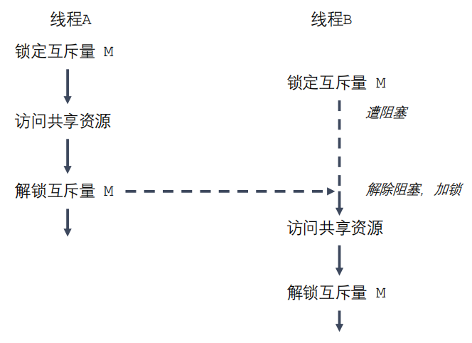

# 线程

## 线程概述

线程(thread)是允许应用程序**并发执行**多个任务的一种机制。一个进程可以包含多个线程，

同一个程序中的所有线程均会独立执行相同的程序，且共享同一份全局内存区域

- 线程是操作系统调度执行的最小单位
- 线程是轻量级的进程`LWP-light weight process`
- 查看指定进程的LWP号：`ps -Lf pid`

### 线程之间的共享资源
共享资源：

非共享资源：
- thread ID
- 信号掩码
- 线程特有数据
- error 变量
- 栈、本地变量和函数的调用链接信息

### 线程和进程区别
- **进程是CPU分配资源的最小单位，线程是操作系统调度执行的最小单位**
- 线程之间能够方便、快速的共享信息，只需要将数据复制到共享变量（全局或堆变量）
- 线程的创建比进程创建块10倍甚至更多。线程间是共享虚拟地址空间的，无需采用写时复制来复制内存，也无需复制页表

### NPTL

查看当前`pthread`库版本：`getconf GNU_LIBPTHREAD_VERSION`

注意：由于`pthread`属于第三方库，编译时需要加上`-pthread`

## 线程相关的函数

```c
// #include<pthread.c>
// compile and link with -pthread

// create thread
int pthread_create(pthread_t *thread, const pthread_attr_t *attr,void *(*start_routine) (void *), void *arg);

// terminate thread
void pthread_exit(void *retval);

// get thread ID
pthread_t pthread_self(void);

// waits for the thread specified to terminate 等待某个特定的线程终止
int pthread_join(pthread_t thread, void **retval);

// mark thread as detached 将某个线程标记为分离，标记后其资源将被系统自动回收
int pthread_detach(pthread_t thread);

// compare if thread ID is equal
int pthread_equal(pthread_t t1, pthread_t t2);
```

### 创建线程

```c
/*
创建线程

    - 操作线程的系统调用均以 pthread 开始

    - main函数的线程称为主线程；其余线程称为子线程；

注意：
	由于pthread不是标准库，因此 Compile and link with -pthread.

int pthread_create(pthread_t *thread, const pthread_attr_t *attr, void *(*start_routine) (void *), void *arg);

- 通过`man 3 pthread_create`查看帮助
- 功能：创建一个子线程
- 参数
  - `thread`：传出参数，线程创建成功后，子线程的线程ID被写到该变量中
  - `attr` : 设置线程的属性，一般使用默认值，NULL
  - `start_routine` : 函数指针，这个函数是子线程需要处理的逻辑代码
  - `arg` : 给第三个参数(`start_routine`)使用，传参
- 返回值
  - 成功：0
  - 失败：返回错误号。这个错误号和之前`errno`不太一样。获取错误号的信息：  `char * strerror(int errnum);`

*/

#include <pthread.h>
#include <stdio.h>
#include <string.h>
#include <unistd.h>

// child thread 执行的函数
void *callback(void *ptr)
{
    printf("child thread\n");
    printf("ptr value : %d\n", *(int *)ptr);
    return NULL;
}

int main()
{
    int num = 10;

    // create thread
    pthread_t tid;	// 传出参数

    int ret = pthread_create(&tid, NULL, callback, (void *)&num);   // 第四个参数可以传进child thread
    if (ret != 0)
    {
        char *errstr = strerror(ret);
        printf("error : %s\n", errstr);
    }

    for(int i = 0; i < 5; ++i)
    {
        printf("%d\n", i);
    }

    sleep(1);   // 防止process结束过快，child thread 还未创建或还未分配到CPU时间片
    /*
    main thread 结束后，进程 process 会终止所有 child thread；
    */

    return 0;
}
```

### 线程终止

在C/C++中，main函数返回，表示main thread结束，同时进程终止（若无特殊设置），操作系统会回收进程占用的所有资源；

```c
/*
验证线程终止

`void pthread_exit(void *retval);`

- 通过`man 3 pthread_exit`查看帮助
- 功能：终止一个线程，在哪个线程中调用，就表示终止哪个线程
- 参数：`retval`，需要传递一个指针，作为一个返回值，可以在`pthread_join()`中获取到

*/
#include <pthread.h>
#include <stdio.h>
#include <unistd.h>

void *threadwork(void *ptr)
{
    printf("Child thread...\n");
    for (int i = 0; i < 20; ++i)
    {
        printf("Child thread: %d\n", i);
        usleep(1000);
    }
    pthread_exit(NULL);
}

int main(int argc, char **argv)
{
    // create thread
    pthread_t tid;
    pthread_create(&tid, NULL, threadwork, NULL);

    // exit main thread
    // 调用pthread_exit后，main thread终止，但进程会继续运行，直到所有线程thread结束(Only for C)
    pthread_exit(NULL);

    return 0;
}
```

**关于线程退出的补充**：

1. 主线程调用`pthread_exit()`后，进程是否立即终止：
     进程在所有前台线程（非守护线程）结束后才会终止；因此，当main thread 调用`pthread_exit()`结束后，若仍有thread在运行，则进程继续运行，直到thread结束；若thread已经结束，则进程终止；
2. 在main函数中直接`return 0`：主线程终止，进程终止；
3. 在主线程中调用`pthread_exit(NULL)`：若仍有子线程在运行，则进程会等待所有的子线程结束后，再终止；
4. `pthread_exit(NULL)`仅限C

### 线程连接(`pthread_join`)

- 什么是线程连接：等待某个ID的线程结束
- `pthread_join`函数阻塞等待线程回收

```c
/*
pthread_join: 和一个已经终止的线程thread连接（等待线程结束）

回收终止的线程，并释放资源

特点：
    - 阻塞函数
    - 调用一次，回收一个thread
    - 一般在main thread 中使用
参数：
    - 第一个: thread ID
    - 第二个：二级指针，接受子线程退出时的返回值
*/

#include <pthread.h>
#include <stdio.h>
#include <string.h>
#include <unistd.h>

void *callback(void *ptr)
{
    printf("child thread ID: %ld\n", pthread_self()); // get current thread ID
    int value = 3;
    pthread_exit((void *)&value); // return (void *)&value;
}

int main()
{
    // create thread
    pthread_t tid;
    int ret = pthread_create(&tid, NULL, callback, NULL);
    if (ret != 0)
    {
        char *errstr = strerror(ret);
        printf("error: %s\n", errstr);
    }

    // Main thread
    for (int i = 0; i < 5; ++i)
    {
        printf("%d\n", i);
    }

    // printf thread ID
    printf("tid = %ld, main thread ID = %ld\n", tid, pthread_self());

    // main thread waiting for child thread exit
    int *pthread_retval;                               // 接收child thread返回值
    ret = pthread_join(tid, (void **)&pthread_retval); // 阻塞等待child thread结束
    if (ret != 0)
    {
        char *errstr = strerror(ret);
        printf("error: %s\n", errstr);
    }
    printf("child thread exit value: %d\n", *pthread_retval); // 输出随机值
    printf("子线程回收成功\n");

    // main thread 退出，对其他正在运行的 thread 没有影响
    pthread_exit(NULL);

    return 0;
}
/*
为什么main thread 接收到的child thread的返回值是随机的？

在child thread中定义的是局部变量，当child thread结束后，内存被释放，所以原局部变量的地址是随机值；
*/
```


### 线程分离(`pthread_detach`)

- 被分离的线程终止时，自动释放资源给操作系统（不需要使用`pthread_join`阻塞等待某线程结束）

```c
/*
线程分离

       #include <pthread.h>

       int pthread_detach(pthread_t thread);

       功能：分离一个线程，被分离的线程终止时，自动释放资源给系统（不需要pthread_join）

       注意：
        - 不能对分离的线程再次连接(pthread_join)
*/

#include <stdio.h>
#include <pthread.h>
#include <string.h>
#include <unistd.h>

void *callback(void *ptr)
{
    printf("child thread ID: %ld\n", pthread_self());
    for (int i = 0; i < 20; ++i)
    {
        printf("Child thread: %d\n", i);
        usleep(1000);
    }
    pthread_exit(NULL);
}

int main()
{
    // create child thread
    pthread_t tid;

    int ret = pthread_create(&tid, NULL, callback, NULL);
    if (ret != 0)
    {
        char *errstr = strerror(ret);
        printf("err: %s\n", errstr);
    }

    // printf thread ID 
    printf("child thread ID: %ld, main thread ID: %ld\n", tid, pthread_self());

    // detach child thread
    pthread_detach(tid);

    // exit main thread
    pthread_exit(NULL);

    return 0;
}
```

### 线程取消(`pthread_cancel`)

- 线程取消即让线程终止，但不是立即终止；当子线程执行到一个取消点，线程才会终止
- 取消点：一些规定好的系统调用；可以通过`man pthreads`查看取消点

```c
/*
线程取消:

    int pthread_cancel(pthread_t thread);

    取消某个线程，即终止某个线程；
    但并不是立即取消，而是等到某个取消点，线程才会取消；
    取消点：一些规定好的系统调用；
*/

#include <stdio.h>
#include <pthread.h>
#include <string.h>

void *callback(void *ptr)
{
    printf("child thread ID: %ld\n", pthread_self());
    for (int i = 0; i < 50; ++i)
    {
        printf("child : %d\n", i);
    }
    pthread_exit(NULL);
}
int main()
{
    // create thread
    pthread_t tid;
    int ret = pthread_create(&tid, NULL, callback, NULL);
    if (ret != 0)
    {
        char *errstr = strerror(ret);
        printf("error: %s\n", errstr);
    }

    // cancel thread
    pthread_cancel(tid);

    for (int i = 0; i < 5; ++i)
    {
        printf("%d\n", i);
    }

    printf("child thread ID: %ld, main thread ID: %ld\n", tid, pthread_self());

    // exit thread
    pthread_exit(NULL);

    return 0;
}

/*
程序解读：
    创建child thread 后，child thread 应该打印0~49，但由于创建child thread 后立即取消线程，
    因此child thread 的内容会提前结束；
*/
```


### 线程属性相关的函数

- 可以设置多种线程属性

```c
/*
线程属性

    step1:初始化线程属性；
    step2:设置线程属性；
    step3:用设置的线程属性创建线程；
    step4:清除线程属性；
    
- 线程属性类型：`pthread_attr_t`
- 初始化线程属性变量：`int pthread_attr_init(pthread_attr_t *attr);`
- 释放线程属性的资源：`int pthread_attr_destroy(pthread_attr_t *attr);`
- 获取线程分离的状态属性：`int pthread_attr_getdetachstate(const pthread_attr_t *attr, int *detachstate);`
- 设置线程分离的状态属性：`int pthread_attr_setdetachstate(pthread_attr_t *attr, int detachstate);`

*/

#include <stdio.h>
#include <pthread.h>
#include <string.h>

void *callback(void *ptr)
{
    printf("child thread ID: %ld\n", pthread_self());
    pthread_exit(NULL);
}

int main()
{
    // 1.初始化线程属性
    pthread_attr_t attr;
    pthread_attr_init(&attr);

    // 2.设置线程分离属性（即设置线程分离）
    int ret = pthread_attr_setdetachstate(&attr, PTHREAD_CREATE_DETACHED);
    if (ret != 0)
    {
        char *errstr = strerror(ret);
        printf("error1: %s\n", errstr);
    }

    // 获取线程栈的大小
    size_t size;
    pthread_attr_getstacksize(&attr, &size);
    printf("thread stack size: %ld\n", size);

    // 3.thread create 并传入线程属性
    pthread_t tid;
    ret = pthread_create(&tid, &attr, callback, NULL); // 3rd 参数 callback 是新线程要执行的内容
    if (ret != 0)
    {
        char *errstr = strerror(ret);
        printf("error2: %s\n", errstr);
    }
    
    // thread ID 
    printf("child thread ID: %ld, main thread ID:%ld\n", tid, pthread_self());

    // 4.释放线程属性
    pthread_attr_destroy(&attr);

    // thread exit
    pthread_exit(NULL);

    return 0;
}
```


## 线程同步

Example: 为什么需要线程同步：

```c
/*
使用多线程实现卖票案例
    存在数据安全问题
*/

#include <stdio.h>
#include <pthread.h>
#include <unistd.h>

int tickets = 100;

void *sellticket(void *ptr)
{
    // sell tickets
    // 访问某一共享资源的代码片段叫做临界区，这段代码的执行应为原子操作
    // 也就是同时访问同一共享资源的其他线程不应该中断该片段的执行
    while (tickets > 0)
    {
        usleep(3000);
        printf("%ld 正在售卖第 %d 张门票\n", pthread_self(), tickets--);
    }
    pthread_exit(NULL);
}

int main()
{
    // 创建三个子线程
    pthread_t tid1, tid2, tid3;
    pthread_create(&tid1, NULL, sellticket, NULL);
    pthread_create(&tid2, NULL, sellticket, NULL);
    pthread_create(&tid3, NULL, sellticket, NULL);

    // 回收子线程资源
    pthread_join(tid1, NULL);
    pthread_join(tid2, NULL);
    pthread_join(tid3, NULL);


    return 0;
}
/*
程序运行结果：
...
140390336726784 正在售卖第 3 张门票
140390345119488 正在售卖第 2 张门票
140390328334080 正在售卖第 1 张门票
140390336726784 正在售卖第 0 张门票
140390345119488 正在售卖第 -1 张门票

为什么会出现复数：
假设此时tickets等于1，当thread A抢占到运行资源，进行while循环，执行usleep；
此时系统资源被thread B抢占，进行while循环，执行usleep;
此时系统资源被thread C抢占，进行while循环，执行usleep;
threadA继续执行，售卖第1张门票，tickets = 0;
threadB继续执行，售卖第0张门票，tickets = -1;
threadC继续执行，售卖第-1张门票，tickets = -2;
当任意线程抢再次占到资源时，tickets此时为-2，线程退出
*/
```

### 线程同步的概念

- **临界区**是指访问某一共享资源的代码片段，并且这段代码的执行应该为**原子操作**，即同时访问同一共享资源的其他线程不应该中断该片段的执行（任一时刻只有一个线程操作共享资源）
- **线程同步**：当有一个线程在堆内存进行操作时，其他线程都不可以对这个内存地址进行操作，直到该线程完成操作，其他线程才能够对该内存地址进行操作

### 互斥锁/互斥量(Mutex)

- 使用互斥锁可以保证**对任一共享资源的原子访问**

- 两种状态：已锁定 未锁定
- 任何时候至多只能有一个线程可以锁定该互斥量；一旦线程锁定互斥量，即称为该互斥量的所有者，只有所有者才能给互斥量解锁
- 步骤：上锁 访问 解锁
- 如果有多个线程试图执行临界区，只有一个线程能够持有该互斥量（其他线程阻塞）



> restrict 关键字：被修饰的指针不能由另外的指针操作

**互斥量操作函数**

```c
- 互斥量的类型：`pthread_mutex_t`
- 初始化互斥量：`int pthread_mutex_init(pthread_mutex_t *restrict mutex, const pthread_mutexattr_t *restrict attr);`
  - 参数
    - `mutex` ： 需要初始化的互斥量变量
    - `attr` ： 互斥量相关的属性，设置为NULL，由内核指定
  - `restrict` : C语言的修饰符，被修饰的指针，不能由另外的一个指针进行操作

- 释放互斥量的资源：`int pthread_mutex_destroy(pthread_mutex_t *mutex);`
- 加锁：`int pthread_mutex_lock(pthread_mutex_t *mutex);`
- 尝试加锁：`int pthread_mutex_trylock(pthread_mutex_t *mutex);`
- 解锁：`int pthread_mutex_unlock(pthread_mutex_t *mutex);`
```

通过互斥量改进多线程售票案例：

```c
/*
互斥量 mutex

    1.create mutex;
    2.initial mutex;
    3.lock & unlock(在临界区前后上锁解锁);
    4.destroy mutex;
*/

#include <stdio.h>
#include <pthread.h>
#include <unistd.h>

// 全局变量，所有线程都共享的资源
int tickets = 100;
pthread_mutex_t mutex;

void *sellticket(void *ptr)
{
    // sell tickets
    // 访问某一共享资源的代码片段叫做临界区，这段代码的执行应为原子操作
    // 也就是同时访问同一共享资源的其他线程不应该中断该片段的执行
    while (1)
    {
        // lock
        pthread_mutex_lock(&mutex);

        if (tickets > 0)
        {
            printf("%ld 正在售卖第 %d 张门票\n", pthread_self(), tickets--);
        }
        else
        {
            // unlock
            pthread_mutex_unlock(&mutex);
            break;
        }
        // unlock
        pthread_mutex_unlock(&mutex);
    }

    pthread_exit(NULL);
}

int main()
{
    // 初始化互斥量
    pthread_mutex_init(&mutex, NULL);

    // 创建三个子线程
    pthread_t tid1, tid2, tid3;
    pthread_create(&tid1, NULL, sellticket, NULL);
    pthread_create(&tid2, NULL, sellticket, NULL);
    pthread_create(&tid3, NULL, sellticket, NULL);

    // 回收子线程资源
    pthread_join(tid1, NULL);
    pthread_join(tid2, NULL);
    pthread_join(tid3, NULL);

    // 释放互斥量
    pthread_mutex_destroy(&mutex);

    return 0;
}
```


### 死锁 

两个或两个以上的线程在执行过程中，因争夺共享资源造成的一种互相等待的现象叫做**死锁**

**产生死锁的场景**

1. 忘记释放锁（解锁）

2. 重复加锁
3. 多线程多锁，抢占资源

```c
/*
演示多线程多锁产生死锁现象
*/

#include <stdio.h>
#include <pthread.h>
#include <unistd.h>

// create mutex
pthread_mutex_t mutex1, mutex2;

void *worka(void *arg)
{
    pthread_mutex_lock(&mutex1);
    sleep(1);                    // 令threadB抢占到系统资源
    pthread_mutex_lock(&mutex2); // 加锁失败阻塞等待，mutex2由threadB持有

    printf("workA...\n");

    pthread_mutex_unlock(&mutex2);
    pthread_mutex_unlock(&mutex1);

    pthread_exit(NULL);
}

void *workb(void *arg)
{
    pthread_mutex_lock(&mutex2);
    sleep(1);                    // 令threadA抢占到系统资源
    pthread_mutex_lock(&mutex1); // 加锁失败阻塞等待，mutex1由threadA持有

    printf("workB...\n");

    pthread_mutex_unlock(&mutex1);
    pthread_mutex_unlock(&mutex2);

    pthread_exit(NULL);
}

int main()
{
    // initial mutex
    pthread_mutex_init(&mutex1, NULL);
    pthread_mutex_init(&mutex2, NULL);

    // create child thread
    pthread_t tid1, tid2;
    pthread_create(&tid1, NULL, worka, NULL);
    pthread_create(&tid2, NULL, workb, NULL);

    // 回收资源
    pthread_join(tid1, NULL);
    pthread_join(tid2, NULL);

    // destroy mutex
    pthread_mutex_destroy(&mutex1);
    pthread_mutex_destroy(&mutex2);

    return 0;
}
```


### 读写锁

- 在对数据的读写操作中，**读操作较多写操作较少时**，互斥锁效率较低；并且多个线程同时读共享资源并不会产生数据安全问题
- 读写锁能够满足多个线程读数据，但只允许一个线程写数据
- 读写锁的特点
  - 如果有线程读数据，则允许其他线程执行读操作，但不允许写操作
  - 如果有线程写数据，则**不允许**其他线程执行读操作/写操作
  - 写的优先级高

**读写锁操作函数**

```c
// 读写锁类型
pthread_rwlock_t;

// 初始化
int pthread_rwlock_init(pthread_rwlock_t *restrict rwlock, const pthread_rwlockattr_t *restrict attr);

// 加锁
int pthread_rwlock_rdlock(pthread_rwlock_t *rwlock);
int pthread_rwlock_wrlock(pthread_rwlock_t *rwlock);

// 尝试加锁
int pthread_rwlock_tryrdlock(pthread_rwlock_t *rwlock);
int pthread_rwlock_trywrlock(pthread_rwlock_t *rwlock);

// 解锁
int pthread_rwlock_unlock(pthread_rwlock_t *rwlock);

// 释放锁资源
int pthread_rwlock_destroy(pthread_rwlock_t *rwlock);
```


```c
/*
读写锁实例：多个线程读、多个线程写
    类型 pthread_rwlock_t
*/

#include <stdio.h>
#include <pthread.h>
#include <unistd.h>

// 共享数据
int num = 1;
pthread_mutex_t mutex;   // 互斥锁
pthread_rwlock_t rwlock; // 读写锁

void *writeData(void *arg)
{
    while (1)
    {
        pthread_rwlock_wrlock(&rwlock);

        ++num;
        printf("write: %ld, num: %d\n", pthread_self(), num);
        sleep(1);

        pthread_rwlock_unlock(&rwlock);
    }
    pthread_exit(NULL);
}

void *readData(void *arg)
{
    while (1)
    {
        pthread_rwlock_rdlock(&rwlock);

        printf("read: %ld, num: %d\n", pthread_self(), num);
        sleep(1);

        pthread_rwlock_unlock(&rwlock);
    }
    pthread_exit(NULL);
}

int main()
{
    // initial mutex
    pthread_rwlock_init(&rwlock, NULL);

    // 创建3个写线程，5个读线程
    pthread_t wtid[3];
    pthread_t rtid[5]; 
    for(int i = 0; i < 3; ++i)
    {
        pthread_create(&wtid[i], NULL, writeData, NULL);
    }
    for(int i = 0; i < 5; ++i)
    {
        pthread_create(&rtid[i], NULL, readData, NULL);
    }

    // thread detach
    for(int i = 0; i < 3; ++i)
    {
        pthread_detach(wtid[i]);
    }
    for(int i = 0; i < 5; ++i)
    {
        pthread_detach(rtid[i]);
    }

    // destroy mutex
    pthread_rwlock_destroy(&rwlock);

    // thread exit
    // 若不设置线程退出，当main函数运行到return 0时，所有子线程也跟着结束
    pthread_exit(NULL);

    return 0;
}
```


### 生产者消费者模型

```c
/*
生产者消费者模型(草稿版，有问题)

    容器：链表
*/

#include <stdio.h>
#include <pthread.h>
#include <stdlib.h>
#include <unistd.h>

// 使用互斥锁解决线程同步的问题
pthread_mutex_t mutex;

// 定义容器
struct Node
{
    int num;
    struct Node *next;
};
struct Node *head = NULL; // 头节点（真实头节点）

void *producer(void *arg)
{
    // 创建新节点添加到链表中
    while (1)
    {
        // lock
        pthread_mutex_lock(&mutex);

        struct Node *newNode = (struct Node *)malloc(sizeof(struct Node));
        // 头插法
        newNode->next = head;
        head = newNode;
        newNode->num = rand();
        printf("tid %ld add node, num: %d\n", pthread_self(), newNode->num);

        // unlock
        pthread_mutex_unlock(&mutex);

        usleep(100);
    }

    pthread_exit(NULL);
}

void *customer(void *arg)
{
    while (1)
    {
        // lock
        pthread_mutex_lock(&mutex);

        struct Node *temp = head;
        if (head != NULL)
        {
            head = head->next;
            printf("tid %ld delete node, num: %d\n", pthread_self(), temp->num);
        }
        free(temp);
        // unlock
        pthread_mutex_unlock(&mutex);

        usleep(100);
    }
    pthread_exit(NULL);
    /*
    消费者的问题：反复查询是否有数据，浪费资源
    */
}

int main()
{
    // initial mutex
    pthread_mutex_init(&mutex, NULL);

    // 5个生产者5个消费者
    pthread_t ptid[5]; // 生产者
    pthread_t ctid[5]; // 消费者

    for (int i = 0; i < 5; ++i)
    {
        pthread_create(&ptid[i], NULL, producer, NULL);
        pthread_create(&ctid[i], NULL, customer, NULL);
    }

    // 分离
    for (int i = 0; i < 5; ++i)
    {
        pthread_detach(ptid[i]);
        pthread_detach(ctid[i]);
    }

    while (1)   // while 循环的作用是？？？
    {
        sleep(10);
    }
    // destroy mutex
    pthread_mutex_destroy(&mutex);

    // 退出main thread
    pthread_exit(NULL);

    return 0;
}
```


### 条件变量

条件变量操作函数：

```c
// 类型：pthread_cond_t

// create cond
pthread_cond_t cond;

// initial cond
pthread_cond_init(&cond, NULL);

// destroy cond
pthread_cond_destroy(&cond);

// 通知另一个线程有信号
pthread_cond_signal(&cond);

// 阻塞等待信号
pthread_cond_wait(&cond, &mutex);
```

使用条件变量改进生产者消费者模型：
```c
/*
条件变量：

    类型：pthread_cond_t
*/

#include <stdio.h>
#include <pthread.h>
#include <stdlib.h>
#include <unistd.h>

// 使用互斥锁解决线程同步的问题
pthread_mutex_t mutex;
// 创建条件变量
pthread_cond_t cond;

// 定义容器
struct Node
{
    int num;
    struct Node *next;
};
struct Node *head = NULL; // 头节点

void *producer(void *arg)
{
    // 创建新节点添加到链表中
    while (1)
    {
        // lock
        pthread_mutex_lock(&mutex);

        struct Node *newNode = (struct Node *)malloc(sizeof(struct Node));
        // 头插法
        newNode->next = head;
        head = newNode;
        newNode->num = rand();
        printf("tid %ld add node, num: %d\n", pthread_self(), newNode->num);
        // 通知消费者消费
        pthread_cond_signal(&cond);
        // unlock
        pthread_mutex_unlock(&mutex);

        usleep(100);
    }

    pthread_exit(NULL);
}

void *customer(void *arg)
{
    while (1)
    {
        // lock
        pthread_mutex_lock(&mutex);

        struct Node *temp = head;
        if (head != NULL)
        {   // 有数据
            head = head->next;
            printf("tid %ld delete node, num: %d\n", pthread_self(), temp->num);
            free(temp);
        }
        else{
            // 无数据，阻塞等待
            pthread_cond_wait(&cond, &mutex);
            /*
            当wait函数阻塞等待时，会给互斥锁解锁；当wait函数不阻塞时，上锁；
            */
        }
        // unlock
        pthread_mutex_unlock(&mutex);

        usleep(100);
    }
    pthread_exit(NULL);

}

int main()
{
    // initial mutex
    pthread_mutex_init(&mutex, NULL);
    // initial cond
    pthread_cond_init(&cond, NULL);

    // 5个生产者5个消费者
    pthread_t ptid[5]; // 生产者
    pthread_t ctid[5]; // 消费者

    for (int i = 0; i < 5; ++i)
    {
        pthread_create(&ptid[i], NULL, producer, NULL);
        pthread_create(&ctid[i], NULL, customer, NULL);
    }

    // 分离
    for (int i = 0; i < 5; ++i)
    {
        pthread_detach(ptid[i]);
        pthread_detach(ctid[i]);
    }

    while (1)   // while 循环的作用是？？？
    {
        sleep(10);
    }
    // destroy mutex
    pthread_mutex_destroy(&mutex);
    // destroy cond
    pthread_cond_destroy(&cond);

    // 退出main thread
    pthread_exit(NULL);

    return 0;
}
```


### 信号量

信号量操作函数：

```c
#include <semaphore.h>

类型：sem_t

- `int sem_init(sem_t *sem, int pshared, unsigned int value);`
  - 功能：初始化信号量
  - 参数
    - `sem`：信号量变量的地址
    - `pshared`：0 用在线程间 ，非0 用在进程间
    - `value `：信号量中的值，代表容器大小
- `int sem_destroy(sem_t *sem);`
  - 功能：释放资源
- `int sem_wait(sem_t *sem);`
  - 功能：对信号量加锁，调用一次对信号量的值-1，如果值为0，就阻塞
- `int sem_trywait(sem_t *sem);`
- `int sem_timedwait(sem_t *sem, const struct timespec *abs_timeout);`
- `int sem_post(sem_t *sem);`
  - 功能：对信号量解锁，调用一次对信号量的值+1
- `int sem_getvalue(sem_t *sem, int *sval);`
```

使用信号量改进生产者消费者模型：
```c
/*
信号量
    生产者消费者模型伪代码：
    
    producer(){
    sem_wait(&psem); // 需求，减1
    sem_post(&csem); // 在售，加1
    }

    customer(){
    sem_wait(&csem); // 购买，减1
    sem_post(&psem); // 待购，加1
    }
*/

#include <stdio.h>
#include <pthread.h>
#include <stdlib.h>
#include <unistd.h>
#include <semaphore.h>

// 使用互斥锁解决线程同步的问题
pthread_mutex_t mutex;
// 创建信号量
sem_t psem; // 生产者信号量
sem_t csem; // 消费者信号量

// 定义容器
struct Node
{
    int num;
    struct Node *next;
};
struct Node *head = NULL; // 头节点

void *producer(void *arg)
{
    // 不断创建新节点添加到链表中（生产产品）
    while (1)
    {
        // sem
        sem_wait(&psem); // psem减1
        // lock
        pthread_mutex_lock(&mutex);

        struct Node *newNode = (struct Node *)malloc(sizeof(struct Node));
        // 头插法
        newNode->next = head;
        head = newNode;
        newNode->num = rand();
        printf("tid %ld add node, num: %d\n", pthread_self(), newNode->num);

        // unlock
        pthread_mutex_unlock(&mutex);
        // sem
        sem_post(&csem); // csem加1
    }

    pthread_exit(NULL);
}

void *customer(void *arg)
{
    while (1)
    {
        // sem
        sem_wait(&csem); // csem减1
        // lock
        pthread_mutex_lock(&mutex);

        struct Node *temp = head;
        head = head->next;
        printf("tid %ld delete node, num: %d\n", pthread_self(), temp->num);
        free(temp);

        // unlock
        pthread_mutex_unlock(&mutex);
        // sem
        sem_post(&psem); // psem加1
    }

    pthread_exit(NULL);
}

int main()
{
    // initial mutex
    pthread_mutex_init(&mutex, NULL);
    // initial 信号量
    sem_init(&psem, 0, 8); // 0:thread之间使用, 8:缓冲区大小
    sem_init(&csem, 0, 0);

    // 5个生产者5个消费者
    pthread_t ptid[5]; // 生产者
    pthread_t ctid[5]; // 消费者

    for (int i = 0; i < 5; ++i)
    {
        pthread_create(&ptid[i], NULL, producer, NULL);
        pthread_create(&ctid[i], NULL, customer, NULL);
    }

    // 分离
    for (int i = 0; i < 5; ++i)
    {
        pthread_detach(ptid[i]);
        pthread_detach(ctid[i]);
    }

    while (1) // while 循环的作用是：保持main thread 存活
    {
        sleep(10);
    }

    // destroy mutex
    pthread_mutex_destroy(&mutex);

    // destroy sem
    sem_destroy(&psem);
    sem_destroy(&csem);

    // 退出main thread
    pthread_exit(NULL);

    return 0;
}
/*
Conclusion:
    - 生产者；
    sem_wait(&psem);                // 1.等待生产许可（缓冲区有空位）；
    pthread_mutex_lock(&mutex);     // 2.加锁，确保共享数据原子操作
    ....                            // 生产数据
    pthread_mutex_unlock(&mutex);   // 3.解锁
    sem_post(&csem);                // 4.通知消费者有新数据

    - 消费者：
    sem_wait(&csem);                // 1.等待消费许可（有生产的数据）；
    pthread_mutex_lock(&mutex);     // 2.加锁，确保原子操作
    ....                            // 消费数据
    pthread_mutex_unlock(&mutex);   // 3.解锁
    sem_post(&psem);                // 4.通知生产者可以继续生产

Attention:
    1. 注意 sem 操作和 mutex互斥锁操作的先后顺序：
    先阻塞等待，再上锁；

    2. 为什么main()中需要while (1):
    保持main thread存活，否则直接销毁互斥量和信号量时，子线程可能还在使用，子线程访问无效资源，
    引发段错误；
*/
```


## 关于线程退出的补充

0. 详见线程终止章节

1. 主线程调用`pthread_exit()`后，进程是否立即终止：
   进程在所有前台线程（非守护线程）结束后才会终止；因此，当main thread 调用`pthread_exit()`结束后，若仍有thread在运行，则进程继续运行，直到thread结束；若thread已经结束，则进程终止；
2. 在main函数中直接`return 0`：主线程终止，进程终止；
3. 在主线程中调用`pthread_exit(NULL)`：若仍有子线程在运行，则进程会等待所有的子线程结束后，再终止；
4. `pthread_exit(NULL)`仅限C

**推荐做法**：

1. 确保主线程等待子线程结束：
   - C： `pthread_join`
   - C++: `std::pthread::join`
2. 避免主线程提前退出，若主线程仍需要提前退出，使用`pthread_exit`（仅限C）